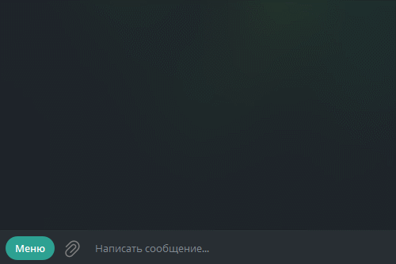
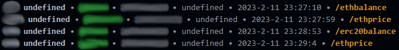

# Telegram Bot CryptoWallet
Телеграм-бот криптокошелёк
## Фичи
- Выводит актуальную цену Etherium
- Баланс коинов и токенов
- Несколько сетей

В будующем добавлю возможность __переводов__
## Установка
1. Чтобы запустить бота, вам понадобится [NodeJS](https://nodejs.org), и библиотеки:
  - [`ethers`](https://npmjs.com/package/ethers)
  - [`telegraf`](https://npmjs.com/package/telegraf)
  - [`eth-price`](https://npmjs.com/package/eth-price)
```sh
npm i ethers telegraf eth-price
```
2. В файле [`wallet.json`](wallet.json) нужно заполнить следующие данные:
  - [`mnemonicPhrase`](https://github.com/i4k1/tgbot-wallet/blob/main/wallet.json#L2) - мнемоническая фраза вашего кошелька `"word word word word"`
  - [`tgbotToken`](https://github.com/i4k1/tgbot-wallet/blob/main/wallet.json#L3) - API токен бота в Telegram (он берётся у [BotFather](https://t.me/BotFather))
  - [`networks`](https://github.com/i4k1/tgbot-wallet/blob/main/wallet.json#L5) - сети, у каждой своё [название](https://github.com/i4k1/tgbot-wallet/blob/main/wallet.json#L6), [`nodeUrl`](https://github.com/i4k1/tgbot-wallet/blob/main/wallet.json#L7) - ссылка на RPC ноду блокчейна (можно взять с [Chainlist](https://chainlist.org)) и [`ERC20`](https://github.com/i4k1/tgbot-wallet/blob/main/wallet.json#L8) - список адресов контракта токена
3. Запустите бота
```sh
node index
```
## Скриншоты
Бот в действии:



Логирование сообщений в терминал:


