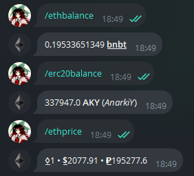

# Telegram Bot CryptoWallet
Телеграм-бот криптокошелёк
## Фичи
- Выводит актуальную цену Etherium
- Баланс коина и вашего токена
- В будующем добавлю возможность __переводов__
## Установка
1. Чтобы запустить бота, вам понадобится NodeJS, и библиотеки:
  - [`ethers`](https://npmjs.com/package/ethers)
  - [`telegraf`](https://npmjs.com/package/telegraf)
  - [`eth-price`](https://npmjs.com/package/eth-price)
2. В файле [`wallet.json`](wallet.json) нужно заполнить следующие данные:
  - `nodeUrl` - ссылка на RPC ноду блокчейна (можно взять с [Chainlist](https://chainlist.org))
  - `privateKey` - приватный ключ вашего кошелька
  - `ERC20` - адресс контракта токена
  - `tgbotToken` - API токен бота в Telegram (он берётся у [BotFather](https://t.me/BotFather))
3. Запустите бота `node index`
## Скриншоты

